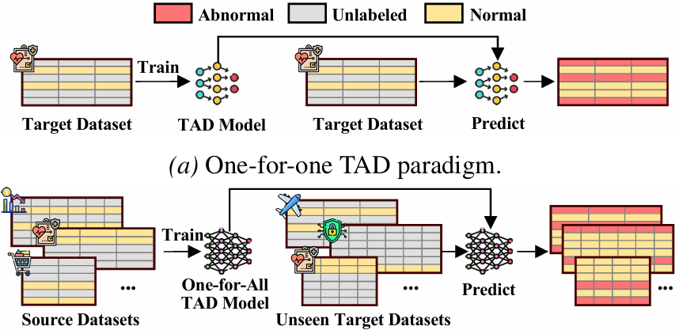
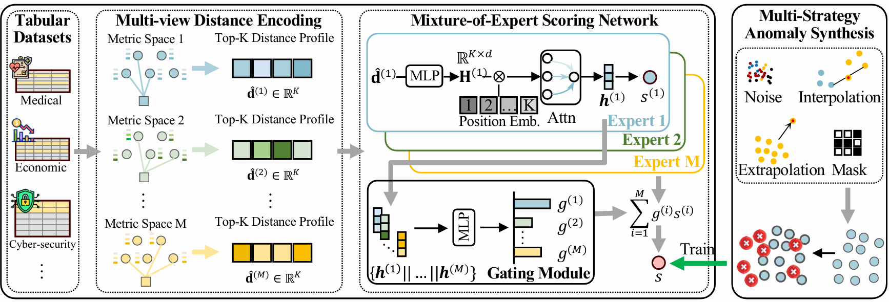

# OFA-TAD

Official implementation of "[Towards One-for-All Anomaly Detection for Tabular Data](https://arxiv.org/abs/2603.14407)", accepted by ICML 2026.

## Overview

### Paradigm: one-for-one → one-for-all



*Figure 1.* Comparison of the classic **one-for-one** workflow versus the proposed **one-for-all** paradigm.

Conventional **one-for-one (OFO)** tabular anomaly detection trains (or heavily tunes) **one specialized model per dataset**: each new domain repeats full dataset-specific optimization. **One-for-all (OFA)** instead learns **a single generalist detector** from multiple **source** tabular datasets and deploys it **on unseen target datasets on-the-fly**, without target-domain retraining—reducing redundant computation and consolidating heterogeneous patterns into one unified model.

### Method (pipeline)



*Figure 2.* Overall **OFA-TAD** pipeline: multi-view top-*K* distance profiles → Mixture-of-Experts scoring with **dataset-specific scaling** via gating → training with synthesized anomalies.

### Performance

Across **34 datasets** spanning **14 application domains** (e.g., healthcare, security, finance), OFA-TAD achieves **strong detection accuracy and cross-domain generalization** in the strict one-for-all setting.

## Requirements

- **Linux** or **Windows** with **NVIDIA GPU** recommended (CUDA **12.1** stack below).
- **Python 3.10**
- Dataset files under `./Data/` as `{dataset}.npz` or `{dataset}.mat` with arrays `X` (features) and `y` (labels: `0` normal, `1` anomaly).

## Installation

Create and activate a conda environment, then install dependencies:

```bash
conda create -n ofatad python=3.10 -y
conda activate ofatad

pip install torch==2.1.2 torchvision==0.16.2 torchaudio==2.1.2 --index-url https://download.pytorch.org/whl/cu121
pip install numpy==1.26.4

pip install torch-scatter torch-sparse torch-cluster torch-spline-conv -f https://data.pyg.org/whl/torch-2.1.2+cu121.html
pip install torch-geometric==2.3.1
pip install python-dateutil
conda install conda-forge::faiss-gpu -y

pip install pandas scikit-learn scipy
```


## Usage

Place datasets in `./Data/` (or pass a custom path). Example:

```bash
python run_ofa_tad.py --data_dir ./Data/
```

## Citation

If you use this code or the paper, please cite:

```bibtex
@inproceedings{li2026towards,
  title     = {Towards One-for-All Anomaly Detection for Tabular Data},
  author    = {Li, Shiyuan and Liu, Yixin and Zheng, Yu and Cao, Xiaofeng and Pan, Shirui and Shen, Heng Tao},
  booktitle = {Proceedings of the International Conference on Machine Learning},
  year      = {2026},
}
```
